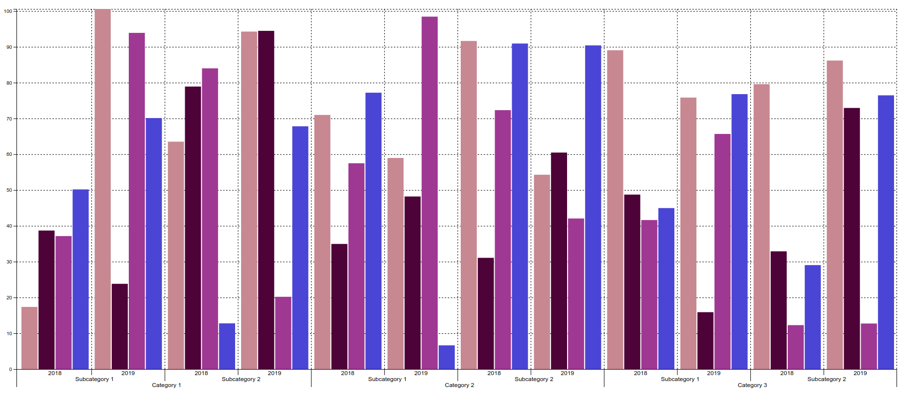

# d3-pivots

D3 plugin allowing to create pivot bar chart from a flat data set.

The plugin aims to follow the convention for developing D3 plugins described in [Towards Reusable Charts](https://bost.ocks.org/mike/chart/) by Mike Bostock.



## Installing

If you are using NPM, you can install the plugin via:

```sh
$ npm install d3-pivots
```

Otherwise, download the [latest release](https://github.com/ksokolovic/d3-pivots/releases/latest) and include it in your page using the `script` tag.

### Dependencies

The plugin depends on the [Underscore](https://underscorejs.org/) JavaScript library. Hence, it must also be included in the `script` tag of your page.

```html
<script src="../build/d3-pivots.min.js"></script>
<script src="https://d3js.org/d3.v4.js"></script>

<!-- Don't forget to include underscore.js -->
<script src="assets/js/underscore-min.js"></script>
```

## Examples

Check out the `examples/example01.html` and the corresponding `data.js` to see the plugin in practice. 

Below is listed the snippet that's used for initializing the pivot bar chart with the sample data set:

```js
let pivot = {
    columns: ['category', 'subcategory', 'year'],
    rows: ['country', 'gender'],
    value: 'value'
};

let pivotBarChart = d3.pivotBarChart()
    .data(data)
    .width(1800)
    .pivot(pivot)
    .axis({xTicks: true, xLabels: true, yTicks: true, yLabels: true})
    .grid({horizontal: true, vertical: true});

d3.select('#chart')
    .call(pivotBarChart);
```

## API Reference

### d3.pivotBarChart()

Initializes and returns a new pivot bar `chart` instance.

### chart.width([width])

Sets or returns the width of the chart.

### chart.height([height])

Sets or returns the height of the chart.

### chart.margin([margin])

Sets or returns the margins of the chart.

`margin` is an object that has the following format and default values: 

```js
{top: 10, right: 25, bottom: 10, left: 25}
```

### chart.data([data])

Sets or returns the data to be rendered on the chart.

### chart.pivot([pivot])

Sets or returns the pivot configuration. 

This configuration object specifies the pivot structure of the original flat data set.

`pivot` is an object that has the following format:

```js
{
    columns: [],
    rows: [],
    value: ''
}
```

The following is included in the `pivot` configuration object:

- `columns`: Array of fields to use as pivot columns. Field values will be sorted in natural sort order when rendering the chart.
- `rows`: Array of fields to use as pivot rows. Field values will be sorted in natural sort order when rendering a chart.
- `value`: Field that corresponds to the actual data point value. Defaults to `value` field.

NOTE: Fields specified in the `pivot` object must match the actual fields from the original data set.

### chart.colors([colors])

Sets or returns the color palette to use for rendering chart. 

The palette has the form of an array of hex color values. By default, the chart is initialized with the palette of random colors.

### chart.axis([axis])

Sets or returns the axis configuration.

This configuration object defines whether tick marks and labels on both x- and y-axis should be displayed. 

`axis` has the following format and default values: 

```js
{
    xTicks: true, 
    xLabels: true, 
    yTicks: true, 
    yLabels: true
}
```

### chart.grid([grid])

Sets or returns the grid configuration.

This configuration object defines whether horizontal and/or vertical grid lines should be displayed. 

`grid` has the following format and default values:

```js
{
    horizontal: true,
    vertical: true
}
```

## Authors

 Name                | E-mail address            | Skype ID
:-------------------:|---------------------------|----------------
 Kemal Sokolović     | kemal.sokolovic@gmail.com | kemal.sokolovic
 Miloš Panasiuk      | milos.panasiuk@gmail.com  | milos.panasiuk

## License

This project is licensed under the MIT license. See the [LICENSE](LICENSE) for details.